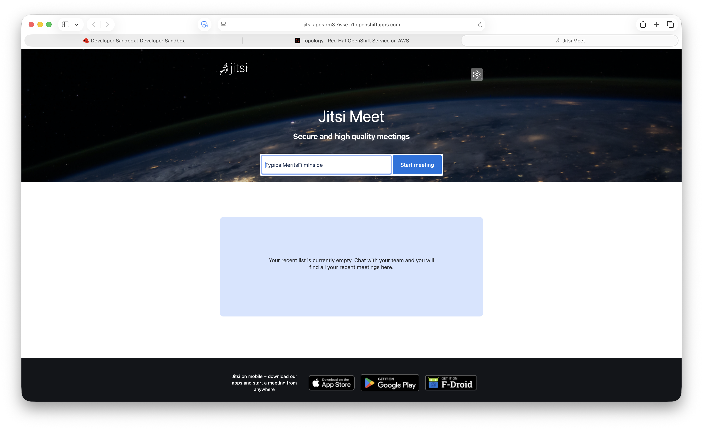
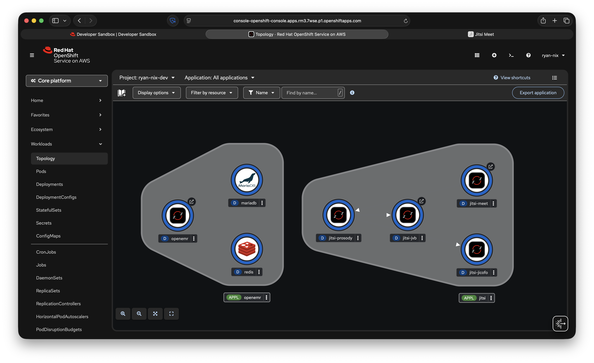

# Jitsi Meet on OpenShift

[](https://quay.io/repository/ryan_nix/jitsi-openshift)
[](https://www.redhat.com/en/technologies/cloud-computing/openshift)
[](https://opensource.org/licenses/Apache-2.0)

OpenShift-native Jitsi Meet — rebuilt from the ground up to run under the `restricted-v2` Security Context Constraint with zero privilege escalation. Designed to deploy alongside OpenEMR for HIPAA-friendly, self-hosted telehealth video conferencing.

> **Part of the [openemr-on-openshift](https://github.com/ryannix123/openemr-on-openshift) project.**

> ⚠️ **Deployment environment matters.** The OpenShift application layer (all four pods, Routes, Services) runs fully under `restricted-v2` SCC on any OpenShift cluster. However, **WebRTC media requires inbound UDP**, which is only achievable on clusters where you control the underlying network — bare metal on-premise, SNO home lab, or cloud clusters with cluster-admin access to Security Groups and LoadBalancer services. See [Where this works](#where-this-works) before deploying.

---

## Why a custom build?

The upstream Jitsi Docker images use **s6-overlay** as an init system. s6-overlay requires `CAP_SYS_ADMIN` to mount a tmpfs over `/run` at container startup — a capability that OpenShift's `restricted-v2` SCC explicitly denies. Every container crashes before the application ever starts.

This project solves that by rebasing all four Jitsi components onto **CentOS Stream 10** with direct `bash` entrypoints that replace s6 entirely. The Jitsi config generation logic (`tpl` + `cont-init.d` scripts) is preserved intact; only the init system is replaced.

---

## Architecture

```
                        ┌─────────────────────────────────────┐
                        │  OpenShift namespace (any project)   │
                        │                                      │
  Browser ──HTTPS──▶  Route ──▶  jitsi-meet (nginx)           │
                        │              │                       │
                        │              ▼                       │
                        │        jitsi-prosody (XMPP)         │
                        │         ▲          ▲                 │
                        │         │          │                 │
                        │   jitsi-jicofo   jitsi-jvb          │
                        │  (conf focus)  (media relay)        │
                        └─────────────────────────────────────┘
                                         │
                              UDP/10000 (NodePort)
                                         │
                              WebRTC media to clients
```

| Component | Base image | Role | Port(s) |
|---|---|---|---|
| **jitsi-meet** | CentOS Stream 10 + nginx | Web UI + nginx reverse proxy | 8080 (HTTP) |
| **jitsi-prosody** | CentOS Stream 10 + prosody (EPEL) | XMPP server | 5222, 5269, 5280, 5347 |
| **jitsi-jicofo** | CentOS Stream 10 + Java 21 | Conference focus / signaling | 8888 (internal) |
| **jitsi-jvb** | CentOS Stream 10 + Java 21 | WebRTC media relay | 10000/UDP, 9090 |



---

## Where this works

Jitsi's application layer is fully OpenShift-compatible. The constraint is the **WebRTC media plane**: Jitsi Videobridge (JVB) requires inbound UDP to deliver video and audio to clients. OpenShift Routes handle only HTTP/HTTPS — UDP cannot pass through them.

| Deployment environment | Application layer | WebRTC media (UDP) | Recommended |
|---|---|---|---|
| **Bare metal on-premise (OCP)** | ✅ restricted-v2 SCC | ✅ Full control of firewall + NodePort | ✅ **Best fit** |
| **SNO home lab** | ✅ restricted-v2 SCC | ✅ Open UDP 10000 on your router | ✅ **Best fit** |
| **ROSA / ARO / cloud OCP** | ✅ restricted-v2 SCC | ⚠️ Requires cluster-admin to open Security Groups + LoadBalancer service | 🔧 Possible with cluster-admin |
| **OpenShift Developer Sandbox** | ✅ restricted-v2 SCC | ❌ No NodePort/LB access, no Security Group control | ❌ Media plane blocked |

### Why bare metal and on-premise are the natural home for this stack

OpenShift on bare metal on-premise is a common pattern in latency-sensitive, UDP-heavy industries — financial services firms running real-time market data feeds over UDP, healthcare organizations requiring full data sovereignty, and research institutions with high-throughput data pipelines all operate this way. The same network control that enables UDP market feeds enables WebRTC media. If your OpenShift cluster can receive inbound UDP for other workloads, it can run Jitsi.

Cloud providers abstract away the underlying network in ways that make inbound UDP difficult or impossible without elevated privileges. This is a fundamental property of managed cloud networking, not an OpenShift limitation.

---

## Network requirements

These are the ports that must be reachable from the internet (or your user network) for Jitsi to function fully. **All application signaling runs over HTTPS/443 via OpenShift Routes** — only the JVB media port requires special handling.

### Required inbound ports on worker nodes

| Port | Protocol | Component | Purpose | How to expose on OpenShift |
|---|---|---|---|---|
| **443** | TCP | jitsi-meet, prosody (WSS) | Web UI, XMPP over WebSocket, all signaling | OpenShift Route (automatic) |
| **10000** | UDP | jitsi-jvb | WebRTC media (audio/video) | `NodePort` or `LoadBalancer` Service |

### Optional / advanced ports

| Port | Protocol | Component | Purpose | Notes |
|---|---|---|---|---|
| **4443** | TCP | jitsi-jvb (TURN/TLS fallback) | TCP media fallback for clients that cannot do UDP | Only needed if deploying coturn |
| **3478** | UDP | coturn | STUN/TURN relay | Only if self-hosting a TURN server |
| **9090** | TCP | jitsi-jvb (Colibri) | JVB REST API + WebSocket transport | Internal only by default; expose via Route if using Colibri WS mode |
| **5222** | TCP | jitsi-prosody | XMPP client connections | Internal cluster only — not exposed externally |

### Firewall rules (bare metal / on-premise OCP)

On a bare metal OpenShift cluster using `firewalld` on worker nodes, add:

```bash
# Open JVB media port — required for WebRTC
firewall-cmd --permanent --add-port=10000/udp
firewall-cmd --permanent --add-port=30000/udp  # if using NodePort 30000

# Optional: TCP fallback
firewall-cmd --permanent --add-port=4443/tcp

firewall-cmd --reload
```

### AWS Security Group rules (ROSA / cloud OCP with cluster-admin)

If deploying on ROSA or a cloud-hosted OpenShift cluster with cluster-admin access:

1. Identify the Security Group attached to your worker nodes (typically named `rosa-<cluster>-worker` or `<cluster>-worker-sg`)
2. Add an inbound rule:

| Type | Protocol | Port range | Source |
|---|---|---|---|
| Custom UDP | UDP | 10000 | 0.0.0.0/0 |
| Custom TCP | TCP | 4443 | 0.0.0.0/0 (optional, TCP fallback) |

3. Change the JVB service type to `LoadBalancer` to get a stable inbound-capable public IP:

```bash
oc patch svc jitsi-jvb-udp -n <namespace> -p '{"spec":{"type":"LoadBalancer"}}'
LB_IP=$(oc get svc jitsi-jvb-udp -o jsonpath='{.status.loadBalancer.ingress[0].hostname}')
oc set env deployment/jitsi-jvb JVB_ADVERTISE_IPS=$LB_IP DOCKER_HOST_ADDRESS=$LB_IP
```

> **Note:** `NodePort` alone is insufficient on ROSA — the NAT Gateway handles outbound traffic but does not forward arbitrary inbound UDP to worker nodes. A `LoadBalancer` service provisions an AWS Network Load Balancer (NLB) with a dedicated public endpoint that supports inbound UDP.

### TURN server (coturn) — for restrictive client networks

If your end users are behind corporate firewalls that block UDP 10000, deploy a coturn TURN server and configure JVB to use it:

```bash
# In your JVB deployment env
JVB_STUN_SERVERS=turn.yourdomain.com:3478
JVB_DISABLE_STUN=false
```

coturn itself requires a public IP with UDP 3478 and TCP 4443 open — the same network control requirement as JVB. On bare metal this is straightforward; on managed cloud it requires the same Security Group access.

---

## Prerequisites

- OpenShift 4.x cluster (Developer Sandbox, ROSA, ARO, SNO, or self-managed)
- `oc` CLI logged in
- `podman` >= 4.x (for building images)
- Quay.io account — images published to `quay.io/ryan_nix/jitsi-openshift`

---

## Quick start

```bash
# 1. Clone the repo and switch to this branch
git clone -b feat/jitsi-openshift-port \
  https://github.com/ryannix123/openemr-on-openshift.git
cd openemr-on-openshift/jitsi

# 2. Build and push all four images
./build-push.sh

# 3. Deploy into your current OpenShift project
sh deploy-jitsi.sh
```

The deploy script auto-detects your cluster's apps domain, generates secrets, provisions a PVC for prosody user data, deploys all four components, sets JVB's ICE harvesting IP, and registers the `focus` and `jvb` XMPP users — all in one run.

---

## Files

```
jitsi/
├── Containerfile.meet              # Jitsi Meet web frontend (CentOS Stream 10 + nginx)
├── Containerfile.prosody           # Prosody XMPP server (CentOS Stream 10 + EPEL)
├── Containerfile.jicofo            # Jicofo conference focus (CentOS Stream 10 + Java 21)
├── Containerfile.jvb               # Jitsi Videobridge (CentOS Stream 10 + Java 21)
├── openshift-entrypoint-meet.sh    # s6-replacement entrypoint for meet
├── openshift-entrypoint-prosody.sh # s6-replacement entrypoint for prosody
├── openshift-entrypoint-jicofo.sh  # s6-replacement entrypoint for jicofo (+ NSS fix)
├── openshift-entrypoint-jvb.sh     # s6-replacement entrypoint for JVB (+ NSS fix)
├── build-push.sh                   # Build and push all images to Quay.io
└── deploy-jitsi.sh                 # Deploy / cleanup script
```

---

## Building images

```bash
# Build all components (native x86_64 recommended — Apple Silicon requires QEMU)
./build-push.sh

# Build a single component
./build-push.sh --component prosody

# Build without pushing (local test)
./build-push.sh --component meet --skip-push

# Pin a specific upstream Jitsi version
VERSION=stable-9909 ./build-push.sh
```

> **Apple Silicon note**: Cross-building `linux/amd64` images on ARM Macs via QEMU
> causes RPM transaction failures during `dnf install`. Build on a native x86_64
> machine or use GitHub Actions with an `ubuntu-latest` runner.

---

## Deployment

### Basic deploy

```bash
sh deploy-jitsi.sh
```

Deploys into your current `oc project`. The script will:

1. Auto-detect the cluster apps domain from ingress config, existing Routes, or the console URL
2. Generate `JICOFO_AUTH_PASSWORD`, `JVB_AUTH_PASSWORD`, `JICOFO_COMPONENT_SECRET` (idempotent — reuses existing Secret on re-runs)
3. Provision a 1Gi PVC for prosody user data (`/config/data`)
4. Deploy prosody, jicofo, JVB, and meet with full `restricted-v2` SCC posture
5. Set `DOCKER_HOST_ADDRESS` on JVB from the Service ClusterIP for ICE harvesting
6. Register `focus@auth.meet.jitsi` and `jvb@auth.meet.jitsi` in prosody

### Options

```bash
sh deploy-jitsi.sh --namespace my-project  # target specific namespace
sh deploy-jitsi.sh --dry-run               # print manifests without applying
sh deploy-jitsi.sh --cleanup               # remove all Jitsi resources
```

### LoadBalancer (production)

For clusters with MetalLB or a cloud LoadBalancer:

```bash
JVB_SERVICE_TYPE=LoadBalancer \
JVB_ADVERTISE_IPS=<your-lb-ip> \
  sh deploy-jitsi.sh
```

---

## OpenShift topology grouping

All resources include `app.kubernetes.io/part-of: jitsi` so they appear grouped
together in the OpenShift Developer topology view — the same way the OpenEMR
stack groups its components. Connection arrows between components are drawn via
`app.openshift.io/connects-to` annotations.



---

## OpenEMR telehealth integration

Once Jitsi is running, configure OpenEMR to use it:

```
Administration → Globals → Telehealth → Jitsi Server
→ https://jitsi.apps.<your-cluster-domain>
```

---

## Key OpenShift compatibility notes

### Why CentOS Stream 10 instead of the upstream Debian images

The upstream `jitsi/web`, `jitsi/prosody`, `jitsi/jicofo`, and `jitsi/jvb` images
all use **s6-overlay v2** as their init system. s6-overlay attempts to mount a
tmpfs over `/run` at startup. In the Jitsi Debian images, `/var/run` is a symlink
to `/run`, and the container runtime mounts a fresh kernel tmpfs over `/run` at
pod start — wiping any build-time permissions. This causes s6 to fail to create
its supervision tree (`/var/run/s6/services/*/supervise/`) before the application
ever launches.

CentOS Stream 10 images with direct `bash` entrypoints bypass this entirely.

### s6 entrypoint replacement

Each entrypoint script:
1. Skips `01-set-timezone` (requires root to `chown /etc/localtime`)
2. Skips scripts with `execlineb` shebangs (pure s6 plumbing)
3. Runs scripts with `with-contenv` shebangs via `bash` directly — this is where
   Jitsi's `10-config` lives, which renders all application config from environment
   variables using the `tpl` Go template binary
4. Strips `apt-cache` and `chown` calls from `with-contenv` scripts (Debian-only
   commands, and chown fails in restricted SCC)
5. Launches the application directly with `exec`

### Java NSS fix (jicofo + JVB)

OpenShift injects an arbitrary UID at runtime. Java's `InetAddress` and libpthread
call `getpwuid()` via NSS, which fails when the injected UID has no `/etc/passwd`
entry. Both Java entrypoints build a `/tmp/passwd` at startup with the injected
UID mapped to the service username, then export `NSS_WRAPPER_PASSWD=/tmp/passwd`.

### nginx configuration

The Jitsi `10-config` script generates a full nginx config at runtime to
`/config/nginx/nginx.conf` — including port 80, `user nginx;`, and a root pid
path. The `openshift-entrypoint-meet.sh` patches all generated configs with `sed`
before starting nginx:
- Port 80 → 8080 (already patched in `/defaults` templates at build time)
- `user nginx;` removed (non-root process)
- `pid /run/nginx.pid` → `pid /tmp/nginx.pid`

### Health probes

| Component | Probes | Reason |
|---|---|---|
| **jitsi-meet** | ✅ HTTP GET `/` on 8080 | nginx binds to 0.0.0.0:8080 |
| **jitsi-prosody** | ❌ Removed | Health endpoint not configured |
| **jitsi-jicofo** | ❌ Removed | Health endpoint binds to `127.0.0.1:8888` (loopback only, unreachable by kubelet) |
| **jitsi-jvb** | ❌ Removed | Health check hard-fails when UDP/10000 is not externally reachable (Developer Sandbox, ROSA) |

### JVB ICE harvesting

JVB needs a bindable local IP for WebRTC ICE candidate harvesting. In managed
OpenShift environments (Sandbox, ROSA, ARO), `oc get nodes` is restricted, so
pod IPs can't be discovered. The deploy script sets `DOCKER_HOST_ADDRESS` to
the `jitsi-jvb-udp` Service ClusterIP — a stable address that persists across
pod restarts and rollouts.

The AWS candidate harvester is disabled (`DISABLE_AWS_HARVESTER=true`) because
the EC2 metadata endpoint times out in the Developer Sandbox, causing a hard
health failure.

### Prosody user registration

Jitsi's upstream `services.d` background service registers the `focus` and `jvb`
XMPP users after prosody starts. On CentOS without s6, this is handled by the
deploy script running `prosodyctl register` via `oc exec` after prosody is ready.
User data is stored in a PVC (`/config/data`) so registrations persist across
prosody pod restarts.

---

## Troubleshooting

### All pods crash on startup

Check the logs:
```bash
{
  echo "=== prosody ===" && oc logs deployment/jitsi-prosody --tail=30
  echo "=== jicofo ===" && oc logs deployment/jitsi-jicofo --tail=30
  echo "=== jvb ===" && oc logs deployment/jitsi-jvb --tail=30
  echo "=== meet ===" && oc logs deployment/jitsi-meet --tail=30
} | pbcopy
```

### Jicofo: `not-authorized` SASL error

The `focus` XMPP user isn't registered. Run:
```bash
JICOFO_PASS=$(oc get secret jitsi-secrets \
  -o jsonpath='{.data.JICOFO_AUTH_PASSWORD}' | base64 -d)
oc exec deployment/jitsi-prosody -- \
  prosodyctl --config /config/prosody.cfg.lua \
  register focus auth.meet.jitsi "${JICOFO_PASS}"
```

### JVB: `No valid IP addresses available for harvesting`

JVB can't find a bindable IP. Set `DOCKER_HOST_ADDRESS` from the Service:
```bash
JVB_IP=$(oc get service jitsi-jvb-udp \
  -o jsonpath='{.spec.clusterIP}')
oc set env deployment/jitsi-jvb DOCKER_HOST_ADDRESS="${JVB_IP}"
```

### Jicofo: `conflict - Replaced by new connection`

Two jicofo pods are running simultaneously during a rolling update. Scale to zero
and back to force a clean single pod:
```bash
oc scale deployment/jitsi-jicofo --replicas=0
sleep 3
oc scale deployment/jitsi-jicofo --replicas=1
```

### Meet: nginx exits immediately

Run an `nginx -t` inside a sleep pod to diagnose config errors:
```bash
oc patch deployment/jitsi-meet \
  -p '{"spec":{"template":{"spec":{"containers":[{"name":"meet","command":["sh","-c","sleep 600"]}]}}}}'
# Wait for Running, then:
oc exec deployment/jitsi-meet -- nginx -t -c /config/nginx/nginx.conf
# Restore:
oc patch deployment/jitsi-meet \
  -p '{"spec":{"template":{"spec":{"containers":[{"name":"meet","command":null}]}}}}'
```

---

## Known limitations and deployment guidance

### The UDP boundary

The single most important thing to understand about self-hosted Jitsi (and any WebRTC media server — Janus, mediasoup, BigBlueButton, coturn) is that **WebRTC media requires inbound UDP**. This is not a Jitsi limitation or an OpenShift limitation — it is a property of the WebRTC protocol itself.

OpenShift Routes are an HTTP/HTTPS proxy. They cannot carry UDP traffic. This means:

- **The OpenShift application layer works everywhere** — all four pods run cleanly under `restricted-v2` SCC on any OpenShift cluster
- **WebRTC media only works where you control the network** — bare metal on-premise, SNO, or cloud clusters where cluster-admin can open Security Groups and provision LoadBalancer services

Attempting to run JVB behind a NAT Gateway on a managed cloud cluster (ROSA, ARO, Developer Sandbox) without a LoadBalancer service results in the error: `No valid IP addresses available for harvesting` — JVB cannot bind to a routable IP because the pod's egress IP is a shared NAT address, not an inbound-capable public IP.

### Colibri WebSocket transport (experimental)

JVB supports sending media over WebSockets (WSS/443) instead of UDP — a mode intended for clients behind corporate firewalls that block UDP. This is configured via:

```bash
oc set env deployment/jitsi-jvb \
  ENABLE_COLIBRI_WEBSOCKET=true \
  JVB_WS_DOMAIN=<jvb-route-hostname> \
  JVB_WS_TLS=true
```

However, in current JVB versions the public HTTP server that hosts the Colibri WebSocket endpoint requires additional configuration to bind correctly in a containerized environment. This mode also carries significant trade-offs: 20–50% higher bandwidth usage, higher CPU load on JVB, and worse quality under packet loss compared to native UDP. It is **not recommended for production telehealth use** where call quality is critical.

### Summary table

| Limitation | Affected environments | Workaround |
|---|---|---|
| WebRTC video requires inbound UDP | Developer Sandbox, ROSA/ARO without cluster-admin | Deploy on bare metal / SNO; or use LoadBalancer + Security Group with cluster-admin |
| AWS NAT Gateway blocks inbound UDP | ROSA NodePort deployments | Use `LoadBalancer` service type to provision an NLB |
| `oc get nodes` forbidden | Developer Sandbox, restricted namespaces | Use Downward API (`status.podIP`) for `LOCAL_ADDRESS` |
| Apple Silicon cross-build failures | QEMU RPM transaction bugs on arm64 hosts | Build on x86_64 or use GitHub Actions |
| JVB health probes disabled | Managed clusters where UDP is unreachable | Re-enable on SNO/bare-metal with open NodePort |
| `apt-cache` stripped from init scripts | All — Debian-only command, not present on CentOS | Harmless — only used for version logging |

---

## Maintainer

Ryan Nix &lt;ryan.nix@gmail.com&gt;  
Red Hat Senior Solutions Architect  
[github.com/ryannix123](https://github.com/ryannix123)  
[quay.io/ryan_nix](https://quay.io/ryan_nix)